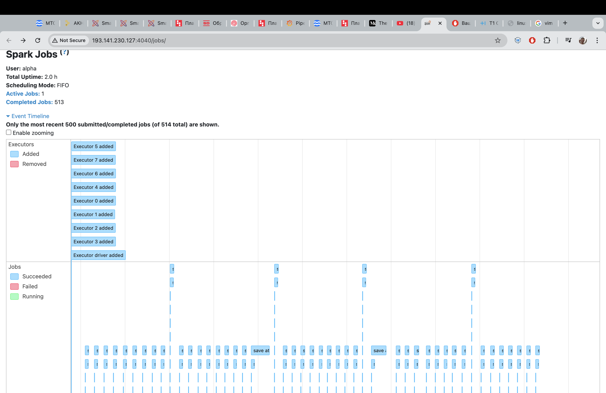
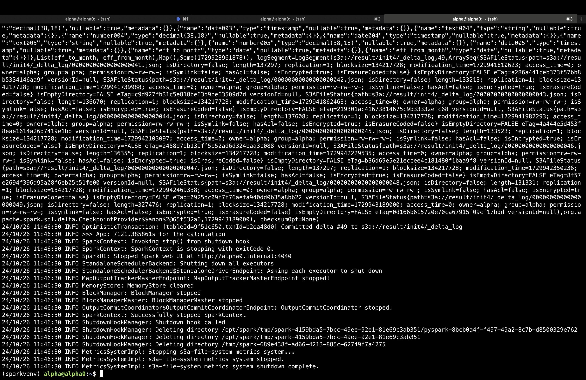

# More.Tech Трек 1. Озеро данных

## Проблематика и что необходимо реализовать

В рамках хакатона MoreTech необходимо было решить задачу оптимизации инкрементной загрузки большого потока данных в S3-хранилище. Заказчиком решения выступал ВТБ. Главная сложность заключается в том, что текущая архитектура озера данных не поддерживает операции обновления, что делает невозможным применение стандартных методов для изменения записей. Это создает проблему для эффективной обработки инкрементальных данных и корректного обновления реплики в приемлемые для пользователей сроки.

## Описание

Реализация инкрементной выгрузки данных типа SCD2 двумя способами:
- через классический Spark с оптимизацией работы с партициями, сжатием и ORC-форматом файлов
- с применением технологии Delta Lake

## Подключение и запуск Spark

Для работы с проектом необходимо установить следующие зависимости:

- Apache Spark
- Delta Lake (прокинули в --packages и conf)
- PySpark

Заходим на эдж-ноду:

```plaintext
ssh -i /path/to/your_login your_login@edge_ip
```
Запускаем Spark:

```plaintext
SPARK_SSH_OPTS='-i /home/your_login/your_login' /opt/spark/sbin/start-all.sh
```

## Запуск решения с отимизацией кода и orc-форматом файлов
Запускаем init-скрипт:

```plaintext
/opt/spark/bin/spark-submit --jars spark-hadoop-cloud_2.13-3.5.3.jar orc_optimization/copy_init_orc.py
```

Запускаем скрипт записи инкремента

```plaintext
/opt/spark/bin/spark-submit --jars spark-hadoop-cloud_2.13-3.5.3.jar orc_optimization/join_orc.py
```

## Запуск решения с отимизацией через Delta Lake
Для запуска Spark с расширением Delta Lake нужно добавить при запуске spark-submit скрипта опцию --package

Запускаем init-скрипт:

```plaintext
/opt/spark/bin/spark-submit --packages io.delta:delta-spark_2.13:3.2.0 --jars spark-hadoop-cloud_2.13-3.5.3.jar delta_lake_solution/copy_init_delta.py
```

Запускаем скрипт записи инкремента

```plaintext
/opt/spark/bin/spark-submit --packages io.delta:delta-spark_2.13:3.2.0 --jars spark-hadoop-cloud_2.13-3.5.3.jar delta_lake_solution/join_delta.py
```
## Рекомендации при проблеме с S3 или Spark на нодах

Первоочередно ребутаем ноды, как воркеры, так и эдж-ноду. Это можно сделать через UI-интерфейс

Далее необходимо смонтировать диски спарка, делаем при помощи команды:
```plaintext
curl -s -sfLk https://gitlab.t1.cloud/events/more-tech2024/-/raw/main/mount-spark.sh?ref_type=heads | sh -
```
Затем, запускаем Spark уже известной командой
```plaintext
SPARK_SSH_OPTS='-i /home/your_login/your_login' /opt/spark/sbin/start-all.sh
```
Делее тестим, запуская любой скрипт .py, обращающийся к S3. Если есть проблемы с DNS, выполняем команду 
```plaintext
curl -s -sfLk https://185.159.111.62/events/more-tech2024/-/raw/main/fix-dns.sh?ref_type=heads  | sh -
```
## Функционал проекта

Необходимо было решить задачу загрузки большого инкремента данных и сделать это максимально оптимально, для того чтобы была возможноть за реалитичное время обрабатывать инкремент в размере 100 млн. строк и записывать его в хранилище с 1 млрд. строк. Решение учитывает изменения данных в инкременте, поступающем на вход, при помощью алгоритма и технологий BigData видоизменяет и затирает необходимые строки данных в источнике, записывает инкремент с учетом всех правил SCD2 загрузки данных и при этом обеспечивает согласованность данных в S3.

## Технологии и инструменты 

- Python: используя данный язык программирования, было реализовано все решение. Удобство его применения заключалось в простоте запуска .py файлов. и удобной интеграции с Apache Spark
- Apache Spark: фреймворк использовался для многопоточной обработки данных, в решении использовали pyspark для интеграции Spark c ЯП Python
- S3: выступало в качетсве хранилища данных, там лежали исходные данные, в нем же были созданы темповые таблицы, которые использовались в решении, также в S3 реализована dm витрина для заказчика
- Delta Lake: уровень хранилища, обеспечивающий надежность озера данных. Delta Lake поддерживает ACID-транзакции и масштабируемую обработку метаданных, объединяя потоковые и пакетные операции с большими данными. Использовался в финальном решении, для решения задачи был выбран метод динамического партиционирования данных, реализованный в DL

## Состав команды и роли

- Евгений Булатов - капитан команды. Являлся главным специалистом по Spark, объяснял особенности его работы и оптимизации. Тюнил основной конфиг спарка, эксперементировал с сочетаниями его параметров при использовании фреймворка Delta Lake для достижения наилучшей производительности, разрабатывал финальное решение, основанное на динамическом партицировании. (github: https://github.com/EvgenyBulatov)
- Болдырев Никита - занимался "запуском" Delta Lake, разбирался с зависимостями, необходимыми для его запуска поверх Spark, участвовал в разработке финального решения, основанного на сочетании референсного решения организаторов и на использовании возможностей динамического партицирования Delta Lake. (github: https://github.com/boldyrevn)
- Афанасьев Максим и Николина Варвара - занималисиь первоначальной оптимизацией Spark без использования Delta Lake. Исследовали его производительность с различными форматами файлов (orc, parquet, etc.) и алогоритмами сжатия (zstd, snappy, etc.), проводили анализ замеров производительсноти, результаты исследования понадобились для защиты итогового решения на питче. (github: Максим - https://github.com/mrapplexz)

## Структура проекта
```
.
├── orc_optimization      # Директория для оптимизации Spark с использованием ORC
│   ├── copy_init_orc.py   
│   ├── join_orc.py         
│   └── check_result_orc.py 
└── delta_lake_solution   # Директория для оптимизации Spark с использованием Delta Lake
    ├── copy_init_delta.py   
    ├── join_delta.py        
    └── check_result_delta.py 

```

## Демонстрация работы проекта

На данных скриншотах можно увидеть визуализацию работы Spark на финальном решении на самом большом датасете в 1 миллиард записей и инкрементом в 100 миллионов записей.





## Заключение

Этот проект важен и интересен, поскольку он продемонстрировал практическую реализацию оптимизации обработки данных в условиях реальных бизнес-требований компании ВТБ и ограниченных ресурсов. Команда использовала мощный фреймворк Delta Lake, правильную конфигурацию Spark и уникальный алгоритм, чтобы создать эффективное решение для инкрементальной выгрузки и обработки данных объемом до миллиарда записей, что стало недоступным для конкурентов. Уникальность проекта в адаптации технологий к специфике задач и мощностей заказчика, что позволяет его применять в аналогичных сценариях работы с большими данными. Для дальнейших улучшений можно исследовать новые подходы к управлению данными, включая использование машинного обучения для автоматизации оптимизаций, а также разработать инструменты мониторинга и диагностики производительности.

## Лицензия

The MIT License (MIT)

Copyright (c) 2024 "КАПИТОШКА МИСИС"
